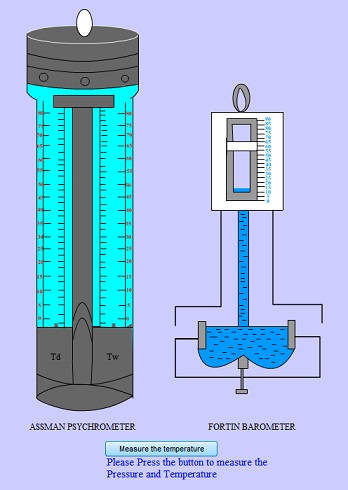
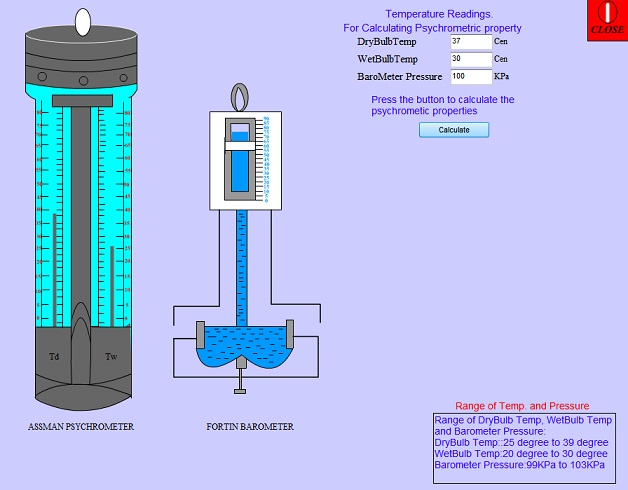
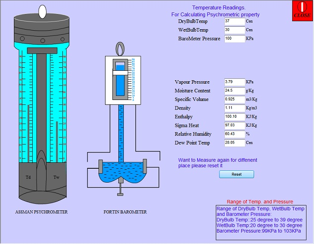

## Procedure

- The wet-bulb thermometer has a cloth wrapped around which is to be made wet with distilled water to get accurate result.
- Before taking a reading, the key should be tightened to rotate the fan and the instrument is left for 3 minutes.
- Then the wet-bulb and dry bulb temperature readings are taken.

## Simulation Procedure
#### Procedure to run the Simulator:

1. Click on the "Measure the Temperature" button first, to measure the fortin barometric pressure and the wet bulb and dry bulb temperature.

2. Then click on the "Calculate" button to measure the Psychrometric Properties for the dry_bulb_temp and wet_bulb_temp and the barometric pressure.

3. After that reset all the fields for next measurement if you want to measure by clicking the button "Reset".

